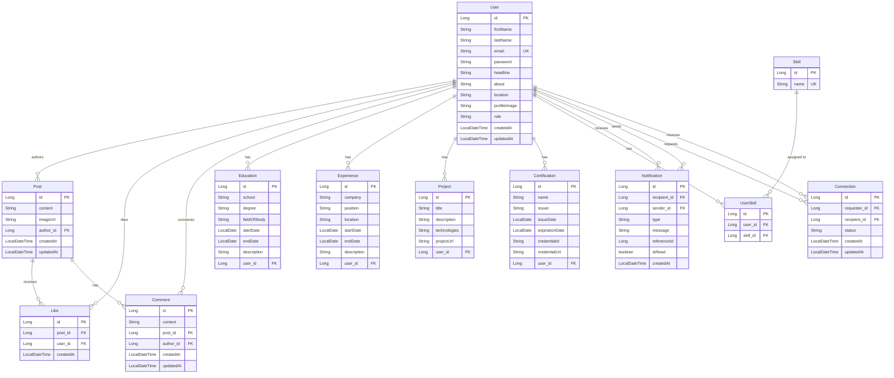

# LinkSphere

## Database Schema (ER Diagram)

```mermaid
erDiagram
    User ||--o{ Post : "authors"
    User ||--o{ Like : "likes"
    User ||--o{ Comment : "comments"
    User ||--o{ Education : "has"
    User ||--o{ Experience : "has"
    User ||--o{ Project : "has"
    User ||--o{ Certification : "has"
    User ||--o{ UserSkill : "has"
    User ||--o{ Notification : "receives"
    User ||--o{ Notification : "sends"
    User ||--o{ Connection : "requests"
    User ||--o{ Connection : "receives"
    
    Post ||--o{ Like : "receives"
    Post ||--o{ Comment : "has"
    
    Skill ||--o{ UserSkill : "assigned to"

    User {
        Long id PK
        String firstName
        String lastName
        String email UK
        String password
        String headline
        String about
        String location
        String profileImage
        String role
        LocalDateTime createdAt
        LocalDateTime updatedAt
    }

    Post {
        Long id PK
        String content
        String imageUrl
        Long author_id FK
        LocalDateTime createdAt
        LocalDateTime updatedAt
    }

    Like {
        Long id PK
        Long post_id FK
        Long user_id FK
        LocalDateTime createdAt
    }

    Comment {
        Long id PK
        String content
        Long post_id FK
        Long author_id FK
        LocalDateTime createdAt
        LocalDateTime updatedAt
    }

    Education {
        Long id PK
        String school
        String degree
        String fieldOfStudy
        LocalDate startDate
        LocalDate endDate
        String description
        Long user_id FK
    }

    Experience {
        Long id PK
        String company
        String position
        String location
        LocalDate startDate
        LocalDate endDate
        String description
        Long user_id FK
    }

    Project {
        Long id PK
        String title
        String description
        String technologies
        String projectUrl
        Long user_id FK
    }

    Skill {
        Long id PK
        String name UK
    }

    UserSkill {
        Long id PK
        Long user_id FK
        Long skill_id FK
    }

    Certification {
        Long id PK
        String name
        String issuer
        LocalDate issueDate
        LocalDate expirationDate
        String credentialId
        String credentialUrl
        Long user_id FK
    }

    Notification {
        Long id PK
        Long recipient_id FK
        Long sender_id FK
        String type
        String message
        Long referenceId
        boolean isRead
        LocalDateTime createdAt
    }

    Connection {
        Long id PK
        Long requester_id FK
        Long recipient_id FK
        String status
        LocalDateTime createdAt
        LocalDateTime updatedAt
    }
```
